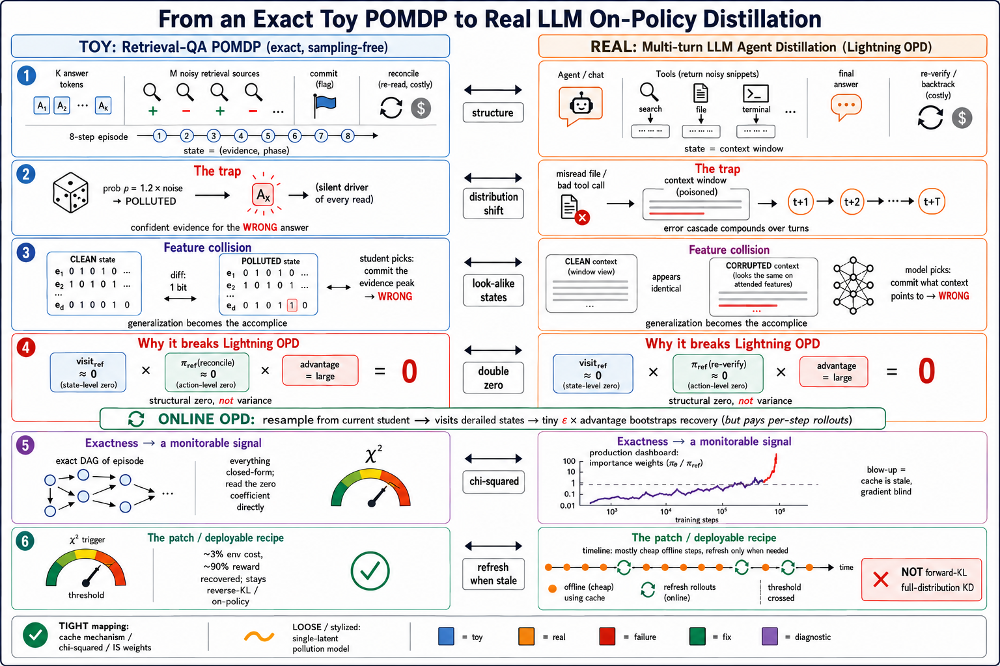
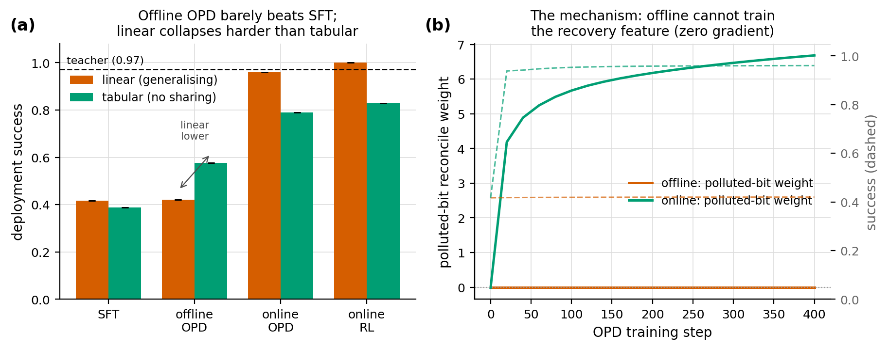
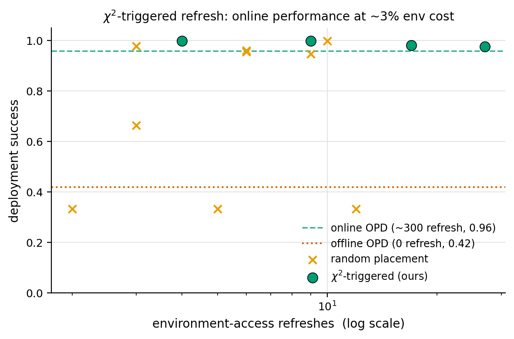

# Offline On-Policy Distillation under Multi-Turn Agentic Distribution Shift

A lightweight, **exact (sampling-free)** study of when and why offline on-policy
distillation (Lightning OPD, arXiv 2604.13010) breaks in a multi-turn agentic
setting — and a theory-driven patch that fixes it cheaply.

Everything runs on CPU in pure NumPy. The information-state process is small and
fully enumerable, so state visitation, policy gradients, the χ² divergence, and
the Theorem 3.5 bound are all computed **in closed form** — no Monte Carlo, no
GPU, no LLM. That is the whole point: we can read the offline/online gradient gap
off exactly instead of arguing about estimator variance.



*The whole study at a glance: each row maps a piece of the CPU toy (left) onto the
real multi-turn LLM OPD pipeline (right). The footer separates the **tight**
correspondences (cache mechanism, χ², importance weights) from what is still
**stylized** (the single-latent pollution model).*

## TL;DR — the four findings

1. **Offline OPD collapses under multi-turn shift; online recovers.** On a
   retrieval-QA POMDP with an emergent pollution trap, offline OPD barely lifts
   off the SFT floor (0.42) while online OPD/RL recover to the teacher ceiling
   (0.96–1.00).
2. **Generalisation is the *accomplice*, not the rescuer.** The linear
   (generalising, ≈ real-model) student collapses *harder* than the tabular one
   (0.42 < 0.58), because it extrapolates the on-path "commit the evidence peak"
   behaviour straight into the polluted trap states.
3. **The failure is a smooth spectrum, not a caricature.** Sweeping the pollution
   rate traces a continuous curve: as the off-support ratio rises 0.37 → 0.82 the
   offline/online gap widens 0.13 → 0.68. With *no* shift, offline = online
   (Theorem 3.6).
4. **The Theorem 3.5 bound is ~10× vacuous**, and worse: the measured gradient
   gap grows while success stays flat — offline OPD is *successfully optimising
   the wrong objective*, because the feature that would trigger recovery is
   structurally starved of gradient.

Patch (Q-vii): a **χ²-staleness-triggered dataset refresh** reaches the online
ceiling at **~3 % of the environment-access cost** (a handful of refreshes vs one
per step) and is **robust across learning rates** where fixed-period refresh
explodes.

## The task in one paragraph

A hidden answer is drawn from K candidates. An agent issues *retrieve* actions
against M > K noisy sources, then *commits* an answer. With probability ρ(noise)
the episode is **polluted**: a wrong answer ã is silently substituted and governs
*all* reads, so the agent accumulates a clean, confident evidence signature for
the wrong answer — an early derailment that compounds over every turn. The agent
observes only a *polluted* phase bit (never which wrong answer). Clean collection
(noise ≈ 0) is essentially never polluted, so offline data never exercises the
polluted bit; deployment noise makes pollution common. The only reliable recovery
is a costly `reconcile` action (an authoritative re-read). This is the
distribution shift the study turns on — emergent from the noise gap, not a
hand-wired secret action.

## Results

### Q-iv: four methods × four metrics (teacher@deploy = 0.973)

| method | linear success | tabular success |
|---|---|---|
| SFT | 0.417 | 0.388 |
| **offline OPD** | **0.420** | **0.576** |
| online OPD | 0.960 | 0.789 |
| online RL | 1.000 | 0.828 |

Run `python experiments/plots.py` to regenerate all figures into
`experiments/results/`.



*Q-iv anatomy: offline OPD (linear student) barely clears the SFT floor while
online OPD/RL climb to the teacher ceiling — the collapse is the gap between the
flat offline curve and the rest.*



*Q-vii patch: a χ²-staleness-triggered dataset refresh reaches the online ceiling
at ~3 % of the per-step environment cost.*

The honest ablation story (verified by a learning-rate sweep, not just the
headline run): χ²-refresh is **not** simply "more accurate than a periodic
schedule." At a small learning rate periodic works fine too. The defensible
claims are (1) the **Pareto win** — χ² hits the online ceiling at ~3 % env cost
at *every* learning rate; (2) **robustness** — χ² bounds the student↔data drift
by construction (it fires when χ² crosses a threshold and resets it, capping the
importance weights), so it never blows up, whereas fixed-period refresh lets
drift accumulate unchecked and explodes to the 1/K floor at larger learning
rates; (3) χ² **self-tunes** its refresh budget with the learning rate.

## Repository structure

```
opd_toy/                core package (pip install -e .)
  env.py                RetrievalQAEnv: enumerable POMDP, undirected-spoof pollution trap
  policies.py           exact Boltzmann teacher; linear-softmax & tabular students; features
  exact.py              sampling-free occupancy, OPD gradient, χ², Theorem 3.5 bound terms
  methods.py            SFT / offline OPD / online OPD / online RL / χ²-refresh patch
experiments/            standalone reproduction scripts
  baseline_table.py     Q-iv: 4 methods × 4 metrics, both students
  coverage_sweep.py     Q-v: success & off-support vs pollution rate
  patch_ablation.py     Q-vii: χ² vs periodic vs random refresh placement
  patch_lr_sweep.py     Q-vii control: robustness across learning rates
  gen_data.py           caches all figure arrays to results/figdata.npz
  plots.py              draws the research-grade figures from the cache
  ...                   (further sweeps and controls)
```

## Reproduce

```bash
pip install -e .                          # installs opd_toy + numpy, matplotlib
python experiments/baseline_table.py      # Q-iv table
python experiments/coverage_sweep.py      # Q-v spectrum
python experiments/patch_ablation.py      # Q-vii ablation
python experiments/patch_lr_sweep.py      # Q-vii robustness control
python experiments/gen_data.py            # cache figure data -> results/figdata.npz
python experiments/plots.py               # draw figures from the cache -> results/
```

Pure NumPy, CPU, runs in minutes. Exact gradients from a fixed init are
deterministic, so single-seed numbers are reproducible to floating point.

## Key design choices (and why)

- **Exact, not Monte Carlo.** The information-state graph is a DAG under a
  potential `φ = depth + (M+1)·[verified]`, so the teacher is one backward pass
  and every occupancy/χ²/σ quantity is one forward pass. We can state the
  offline gradient coefficient *is* zero, not "is high-variance."
- **Undirected spoof + observable pollution bit.** Makes a polluted state
  *feature-identical* to a clean confident state for the wrong answer, so a
  generalising student is actively misled — the mechanism that makes even the
  linear student collapse.
- **`reconcile_cost` knob.** Tuned (0.8) so the teacher never reconciles on the
  clean path (keeping it off the reference demonstrations, so the polluted-bit
  weight stays untrained offline) yet reconciles when polluted.
